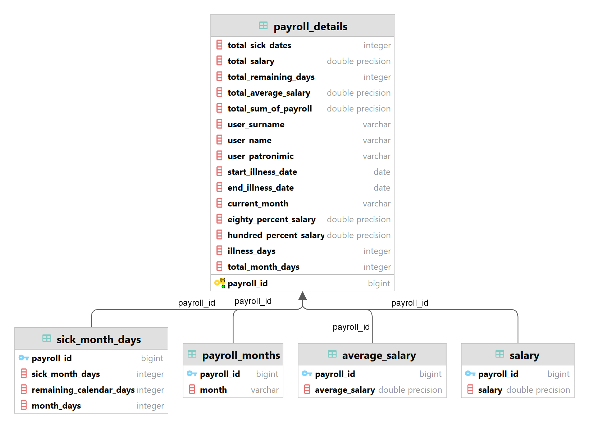

# 💰 PayRoll — Employee Payroll Management System

> A desktop application for managing employee payroll, built with Java Swing and a relational database.

---

## 📖 Description

**PayRoll** is a desktop application for managing employee salaries and payroll records. It provides an interface for tracking employees, calculating wages, and managing payment data — all stored in a relational database. The project was developed as a coursework assignment in IntelliJ IDEA with manual compilation via a batch script.

---

## ✨ Features

- 👤 Manage employee records
- 💵 Calculate and track salary payments
- 🗄️ Persistent storage via a relational database (see `database.png` for schema)
- 🖥️ Native desktop UI built with Java Swing
- 📦 Runs as a standalone executable JAR

---

## 🗂️ Project Structure

```
PayRoll/
├── src/main/           # Java source code (UI, controllers, models, DB layer)
├── lib/                # External JAR dependencies (e.g. JDBC driver)
├── META-INF/           # JAR manifest (entry point definition)
├── compile.bat         # Windows batch script to compile and build the project
├── database.png        # Database schema diagram
└── coursework-payroll.iml  # IntelliJ IDEA module file
```

---

## 🛠️ Tech Stack

| Component     | Technology                        |
|---------------|-----------------------------------|
| Language      | Java                              |
| UI Framework  | Java Swing                        |
| Database      | SQL (MySQL / SQLite)              |
| DB Access     | JDBC                              |
| Build         | Manual (`compile.bat`)            |
| IDE           | IntelliJ IDEA                     |

---

## 🗄️ Database Schema

The database schema is documented in `database.png` at the root of the repository.



---

## 🚀 Getting Started

### Prerequisites

- **JDK 8+** installed and added to `PATH`
- A running **MySQL** (or compatible) database instance
- Configure the DB connection string in the source before building

### Build

Run the provided batch script on Windows:

```bat
compile.bat
```

This will compile the sources and produce a runnable JAR in the project directory.

### Run

```bash
java -jar PayRoll.jar
```

Or open the project directly in **IntelliJ IDEA** and run from the IDE.

---

## 🎓 Academic Context

This project was developed as a coursework assignment. Key topics applied:

- Relational database design and JDBC integration
- Desktop UI development with Java Swing
- MVC-style separation of UI, logic, and data layers
- Manual JAR packaging with `META-INF/MANIFEST.MF`

---
